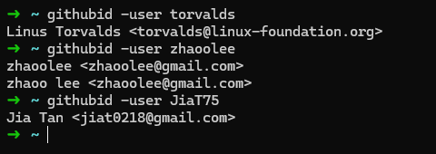

# GithubID

GithubID is an OSINT tool that can be used to retrieve the identities (name/email) that a given Github user has used in their public commits.

Under the hood, this uses Github's GraphQL API to query for the commits a user has pushed and then extracts their contact information from them.



## Usage

You'll need a Github Token to use this tool. You can generate a Personal Access Token [here](https://github.com/settings/tokens).

You can set your token as the `GH_TOKEN` environment variable or pass it through a flag:
```bash
$ githubid -user torvalds -token <your github token>
```

## TODO

- [ ] Add pagination support for the GraphQL call;
- [ ] Add [gharchive.org](https://www.gharchive.org/)/bigquery support to allow finding deleted commits (accidentally got a $100 bill from google cloud and am too depressed to do this now);